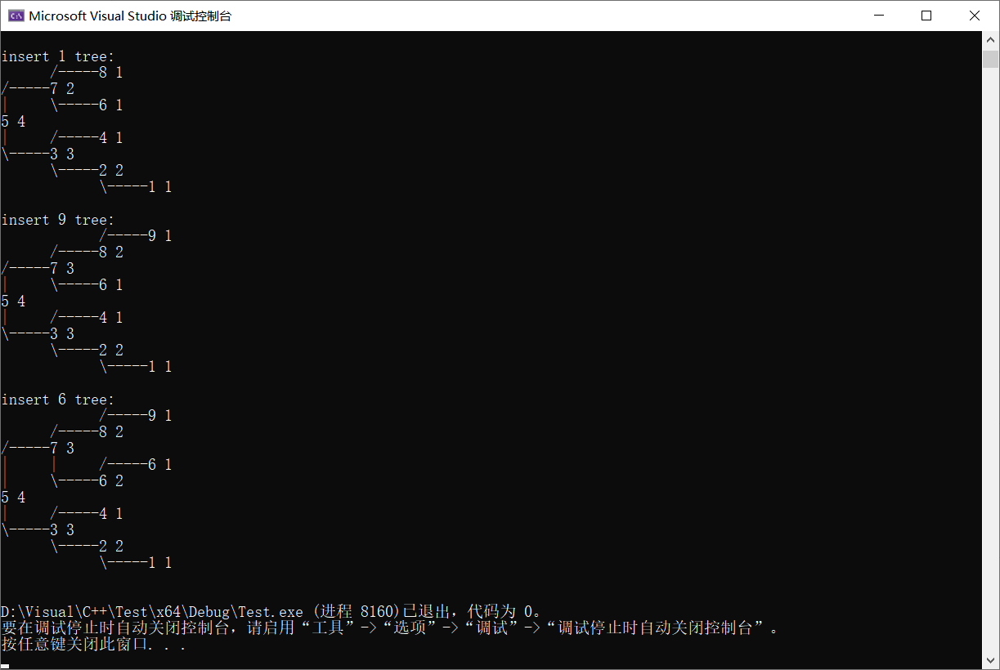

这个网上有很多讲解，我就大概记录下自己个人的理解。

## 一、平衡二叉树
### 1、定义
平衡二叉树（Balanced Binary Tree）又被称为AVL树（有别于AVL算法）。且具有以下

1. 可以是空树
2. 假如不是空树，任何一个结点的左子树与右子树都是平衡二叉树，并且高度之差的绝对值不超过 1

### 2、为什么要平衡二叉树
（1）优点
这个方案很好的解决了二叉查找树退化成链表的问题，**把插入，查找，删除的时间复杂度最好情况和最坏情况都维持在O(logN)**。
（2）缺点
但是频繁旋转会使插入和删除牺牲掉O(logN)左右的时间，不过相对二叉查找树来说，时间上稳定了很多。

## 二、算法思想
**（个人理解，错了请指出）**

### 1、平衡算法
简单的来说，平衡二叉树的性质决定了算法思想：<font color=red>**任何一个结点的左子树与右子树都是平衡二叉树，并且高度之差的绝对值不超过 1**</font>。

**根节点不平衡，下面子树（的最高树）与根节点不平衡方向一致**
**（1）LL型调整**
当左子树高度**大于**右子树高度在 1 以上，就进行**右旋**（顺时针旋转），把节点移到右子树，左子树当父节点，以此来使左子树高度减 1，右子树高度加 1。
**（2）RR型调整**
当左子树高度**小于**右子树高度在 1 以上，就进行**左旋**（逆时针旋转），把节点移到左子树，右子树当父节点，以此来使左子树高度加 1，右子树高度减 1。

**根节点不平衡，下面子树（的最高树）与根节点不平衡方向不一致**
**（3）LR型调整**
当左子树高度**大于**右子树高度在 1 以上，**子树的最高树在右边**，先进行**左旋**（逆时针旋转），再进行**右旋**（顺时针旋转）

**（4）RL型调整**
当左子树高度**小于**右子树高度在 1 以上，**子树的最高树在左边**，先进行**右旋**（顺时针旋转），再进行**左旋**（逆时针旋转）

**疑惑**
前两个都能理解这么旋转，只能这么旋转。
后两个可能很多人想为什么这么旋转，为什么不直接都移下来

1. 已经有了左旋和右旋，直接可以用（改变数据较少）
2. 直接移下来改变的数据太多，**不通用**（当最上面是根节点和不是根节点要改变的数据不一样）

（PS：左细线代表 L，右细线代表 R）


### 2、插入节点
每插入一个节点调用平衡算法实现**从底向上平衡整棵树**。

1. 根据键值递归找到新节点插入位置
2. 新建节点连接到该位置
3. 连接父节点到上面一个节点
4. 然后从该节点依次实现平衡，根据父节点向上遍历（因为只有该条路径高度产生变化），更新高度

### 3、删除节点
删除节点调用平衡算法实现平衡删除节点。

1. 根据键值递归找到删除节点位置

2. 当左右节点都存在时

   > 判断左子树不比右子树高度
   >
   > （1）如果左子树高
   >
   > - 找出 root 的左子树中的最大节点
   > - 将该最大节点的值赋值给 root
   > - 删除该最大节点
   >
   > （2）如果右子树高
   >
   > - 找出tree的右子树中的最小节点
   >
   > - 将该最小节点的值赋值给tree
   > - 删除该最小节点


3. 当左右节点不都存在时

   > 直接用存在的子节点覆盖


## 三、原理解释

### 1、平衡实现

```cpp
/*****************************************************************************
1. LL型（753）：单右旋
以（5）为轴，将（7）右旋
		 7
		/ \
	   5   8                 5
	  / \      ------>     /    \
	 3   6                3      7
	/ \                  / \    / \
   2   4                2   4  6   8
2. LR型（846）：先左旋后右旋
（89）不变，先以（6）为轴，将（4）左旋，然后把（6）拼接到（8）下面；再以（6）为轴，将（8）右旋
ps：因为旋转指针指向没变，导致指向有问题，需要重新连接。
		 8                    8
		/ \                  / \
	   4   9                6   9                    6
	  / \      ------>     / \         ------>    /    \
	 3   6                4   7                  4      8
		/ \              / \                    / \    / \
	   5   7            3   5                  3   5  7   9
3. RR型（357）：单左旋
以（5）为轴，将（3）左旋
	 3
	/ \
   2   5                     5
	  / \      ------>    /    \
	 4   7               3      7
		/ \             / \    / \
	   6   9           2   4  6   9
4. RL型（486）：先右旋后左旋
（34）不变，先以（6）为轴，将（8）右旋，然后把（6）拼接到（4）下面；再以（6）为轴，将（4）左旋
ps：因为旋转指针指向没变，导致指向有问题，需要重新连接。
		 4                   4
		/ \                 / \
	   3   8               3   6                       6
		  / \   ------>       / \       ------>     /    \
		 6   9               5   8                 4      8
		/ \                     / \               / \    / \
	   5   7                   7   9             3   5  7   9
*****************************************************************************/
```


## 四、代码实现

网上主要有两种代码实现

1. **左右节点指针**：[平衡二叉树（AVL树）](https://www.cnblogs.com/sench/p/7786718.html)
2. **包含父节点指针**：

### 1、结构体

本代码使用父节点实现

```cpp
typedef struct _Adelson_Velsky_Landis_Node {    // 树结构体节点
    int                                 key;    // 键值
    int                                 value;  // 信息
    int                                 height; // 高度（平衡因子）
    struct _Adelson_Velsky_Landis_Node* parent; // 父节点
    struct _Adelson_Velsky_Landis_Node* left;   // 左节点
    struct _Adelson_Velsky_Landis_Node* right;  // 右节点
} AVLNode;
```

### 2、全部代码

```cpp
#define _CRT_SECURE_NO_WARNINGS // VS 忽略安全警告

#include <stdio.h>
#include <stdlib.h>
#include <string.h>

#define STR_SIZE 1024

typedef struct _Adelson_Velsky_Landis_Node {    // 树结构体节点
    int                                 key;    // 键值
    int                                 value;  // 信息
    int                                 height; // 高度（平衡因子）
    struct _Adelson_Velsky_Landis_Node* parent; // 父节点
    struct _Adelson_Velsky_Landis_Node* left;   // 左节点
    struct _Adelson_Velsky_Landis_Node* right;  // 右节点
} AVLNode;

/*
*	相关树函数
*/
int      max(int a, int b);                         // 最大值
int      height(AVLNode* root);                     // 通过结构体，直接返回树高度
int      height_update(AVLNode* root);              // 更新树的高度
AVLNode* new_node(int key, int value);              // 新建节点，赋初值
AVLNode* insert(AVLNode* root, int key, int value); // 插入节点
AVLNode* find_min(AVLNode* root);                   // 查找子结点中最小的节点
AVLNode* find_max(AVLNode* root);                   // 查找子结点中最大的节点
AVLNode* delete_node(AVLNode* root, int key);       // 删除节点
void     delete_tree(AVLNode* root);                // 删除树

/*
*	AVL函数
*/
int      get_balance(AVLNode* root);  // 得到平衡因子
AVLNode* rotate_left(AVLNode* root);  // 左旋
AVLNode* rotate_right(AVLNode* root); // 右旋
AVLNode* balance_node(AVLNode* root); // 判断节点该怎么平衡调整

/*
*	通用函数（画树）
*/
void draw(AVLNode* root);                             // 画树，根节点
void draw_level(AVLNode* root, bool left, char* str); // 画树，左右子树

int main() {
    AVLNode* root = NULL;
    /*
    *	大数据测试
    */
    int nums[]   = {6, 8, 2, 3, 5, 4, 7, 1, 9, 6};
    int numsSize = sizeof(nums) / sizeof(nums[0]);
    // 添加
    for (int i = 0; i < numsSize; i++) {
        root = insert(root, nums[i], nums[i] + 10);
        printf("insert %d tree:\n", nums[i]);
        draw(root);
    }

    // 删除
    // for (int i = 0; i < numsSize; i++) {
    //     root = delete_node(root, nums[i]);
    //     printf("delete %d tree:\n", nums[i]);
    //     draw(root);
    // }

    return 0;
}

int max(int a, int b) {
    return (a > b) ? a : b;
}

int height(AVLNode* root) {
    if (root == NULL) {
        return 0;
    }
    return root->height;
}

// 更新节点高度
int height_update(AVLNode* root) {
    if (root == NULL) {
        return 0;
    }
    int height_left  = height(root->left) + 1;
    int height_right = height(root->right) + 1;
    root->height     = max(height_left, height_right);
    return root->height;
}

/*****************************************************************************
* @date    2020/4/20
* @brief   新建节点
* @param   key		键值
* @param   value	信息
* @return  node     新节点
*****************************************************************************/
AVLNode* new_node(int key, int value) {
    AVLNode* node = (AVLNode*)malloc(sizeof(AVLNode));
    node->key     = key;
    node->value   = value;
    node->height  = 1;
    node->parent  = NULL;
    node->left    = NULL;
    node->right   = NULL;
    return node;
}

/*****************************************************************************
* @date    2020/4/19
* @brief   插入数据，创建平衡树
* @param   root     树
* @param   key      键值
* @param   value    信息
* @return  node     树根节点
*****************************************************************************/
AVLNode* insert(AVLNode* node, int key, int value) {
    if (node == NULL) {
        node = new_node(key, value);
        return node;
    }

    if (key < node->key) {
        node->left = insert(node->left, key, value);
    } else {
        node->right = insert(node->right, key, value);
    }
    node = balance_node(node);
    height_update(node);
    return node;
}

// 得到平衡因子
int get_balance(AVLNode* root) {
    if (root == NULL) {
        return 0;
    }
    return height_update(root->left) - height_update(root->right);
}

/*****************************************************************************
1. LL型：单右旋
以（5）为轴，将（7）右旋
         7
        / \
       5   8                 5
      / \      ------>     /    \
     3   6                3      7
    / \                  / \    / \
   2   4                2   4  6   8
2. LR型：先左旋后右旋
（89）不变，先以（6）为轴，将（4）左旋，然后把（6）拼接到（8）下面；再以（6）为轴，将（8）右旋
ps：因为旋转指针指向没变，导致指向有问题，需要重新拼接。
         8                    8
        / \                  / \
       4   9                6   9                    6
      / \      ------>     / \         ------>    /    \
     3   6                4   7                  4      8
        / \              / \                    / \    / \
       5   7            3   5                  3   5  7   9
3. RR型：单左旋
以（5）为轴，将（3）左旋
     3
    / \
   2   5                     5
      / \      ------>    /    \
     4   7               3      7
        / \             / \    / \
       6   9           2   4  6   9
4. RL型：先右旋后左旋
（34）不变，先以（6）为轴，将（8）右旋，然后把（6）拼接到（4）下面；再以（6）为轴，将（4）左旋
ps：因为旋转指针指向没变，导致指向有问题，需要重新拼接。
         4                   4
        / \                 / \
       3   8               3   6                       6
          / \   ------>       / \       ------>     /    \
         6   9               5   8                 4      8
        / \                     / \               / \    / \
       5   7                   7   9             3   5  7   9
*****************************************************************************/
// 右旋，LL型
AVLNode* rotate_right(AVLNode* root) {
    AVLNode* node = root->left;
    if (node->right != NULL) { //更新父结点
        node->right->parent = root;
    }
    if (root->parent != NULL) { //上上级节点重新指向旋转后的节点
        if (root->parent->right == root) {
            root->parent->right = node;
        } else {
            root->parent->left = node;
        }
    }
    root->left  = node->right; //右旋（这里是关键）
    node->right = root;

    node->parent = root->parent; //更新父结点
    root->parent = node;
    root->height = height_update(root); //更新高度
    node->height = height_update(node);
    return node;
}

// 左旋，RR型
AVLNode* rotate_left(AVLNode* root) {
    AVLNode* node = root->right;
    if (node->left != NULL) { //更新父结点
        node->left->parent = root;
    }
    if (root->parent != NULL) { //上上级节点重新指向旋转后的节点
        if (root->parent->right == root) {
            root->parent->right = node;
        } else {
            root->parent->left = node;
        }
    }
    root->right = node->left; //左旋（这里是关键）
    node->left  = root;

    node->parent = root->parent; //更新父结点
    root->parent = node;
    root->height = height_update(root); //更新高度
    node->height = height_update(node);
    return node;
}

// 判断平衡类型
AVLNode* balance_node(AVLNode* root) {
    if (get_balance(root) > 1 && get_balance(root->left) > 0) {
        // LL型，单右
        return rotate_right(root);
    }
    if (get_balance(root) > 1 && get_balance(root->left) <= 0) {
        // LR型，先左后右
        root->left = rotate_left(root->left);
        return rotate_right(root);
    }
    if (get_balance(root) < -1 && get_balance(root->right) <= 0) {
        // RR型，单左
        return rotate_left(root);
    }
    if (get_balance(root) < -1 && get_balance(root->right) > 0) {
        // RL型，先右后左
        root->right = rotate_right(root->right);
        return rotate_left(root);
    }
    return root;
}

/*****************************************************************************
* @date   2020/4/19
* @brief  水平画树
* @param  root  树
* @param  left  判断左右
* @param  str   可变字符串
*****************************************************************************/
void draw_level(AVLNode* root, bool left, char* str) {
    if (root->right) {
        draw_level(root->right, false, strcat(str, (left ? "|     " : "      ")));
    }

    printf("%s", str);
    printf("%c", (left ? '\\' : '/'));
    printf("-----");
    printf("%d ", root->key);
    printf("%d\n", root->height);

    if (root->left) {
        draw_level(root->left, true, strcat(str, (left ? "      " : "|     ")));
    }
    str[strlen(str) - 6] = '\0';
}

void draw(AVLNode* root) {
    char str[STR_SIZE];
    memset(str, '\0', STR_SIZE);

    if (root == NULL) {
        return;
    }

    if (root->right) {
        draw_level(root->right, false, str);
    }
    printf("%d ", root->key);
    printf("%d\n", root->height);
    if (root->left) {
        draw_level(root->left, true, str);
    }
    printf("\n");
}

// 查找最小节点
AVLNode* find_min(AVLNode* node) {
    if (node->left == NULL) {
        return node;
    }
    return find_min(node->left);
}

// 查找最大节点
AVLNode* find_max(AVLNode* node) {
    if (node->right == NULL) {
        return node;
    }
    return find_max(node->right);
}

/*****************************************************************************
* @date    2020/4/21
* @brief   删除平衡树节点
* @param   root 树
* @param   key	键值
* @return  root 树根节点
*****************************************************************************/
AVLNode* delete_node(AVLNode* root, int key) {
    if (root == NULL) {
        return NULL;
    }
    if (key < root->key) {
        root->left = delete_node(root->left, key);
        balance_node(root->left);
    } else if (key > root->key) {
        root->right = delete_node(root->right, key);
        balance_node(root->right);
    } else {
        if (root->left != NULL && root->right != NULL) {
            if (height(root->left) < height(root->right)) {
                /**
                 * 如果tree的左子树不比右子树高(即它们相等，或右子树比左子树高1)
                 *  - 找出tree的右子树中的最小节点
                 *  - 将该最小节点的值赋值给tree
                 *  - 删除该最小节点
                 * 这类似于用"tree的左子树中最大节点"做"tree"的替身
                 * 采用这种方式的好处是：删除"tree的左子树中最大节点"之后，AVL树仍然是平衡的
                 */
                AVLNode* minNode = find_min(root->right);
                root->key        = minNode->key;
                root->right      = delete_node(root->right, minNode->key);
            } else {
                /**
                 * 如果tree的左子树比右子树高
                 *  - 找出tree的左子树中的最大节点
                 *  - 将该最大节点的值赋值给tree
                 *  - 删除该最大节点
                 */
                AVLNode* maxNode = find_max(root->left);
                root->key        = maxNode->key;
                root->left       = delete_node(root->left, maxNode->key);
            }
        } else {
            AVLNode* tmp = root;
            root         = (root->left != NULL) ? root->left : root->right;
            delete tmp;
        }
    }
    height_update(root);
    return root;
}

// 释放树
void delete_tree(AVLNode* root) {
    if (root != NULL) {
        delete_tree(root->left);
        delete_tree(root->right);
        free(root);
    }
}
```

## 五、结果




## 六、总结
### 1、优缺点

**（1）包含父节点**

1. 容易理解
2. 但是需要修改维护的节点很多，容易出错

**（2）不包含父节点**

1. 维护节点少，不容易出错
2. 提取共有函数较少，需要在函数中更新连接节点

### 2、平衡树构建
动态平衡树构建——网页版

网址：`https://www.cs.usfca.edu/~galles/visualization/AVLtree.html`


## 参考资料

(1) [平衡二叉树（AVL树）](https://www.cnblogs.com/sench/p/7786718.html): https://www.cnblogs.com/sench/p/7786718.html

(2) [什么是平衡二叉树（AVL）](https://www.cnblogs.com/fivestudy/p/10340647.html): https://www.cnblogs.com/fivestudy/p/10340647.html

(3) [数据结构（一）-- 平衡树](https://www.cnblogs.com/Benjious/p/10336145.html): https://www.cnblogs.com/Benjious/p/10336145.html

