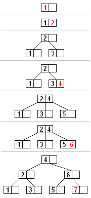
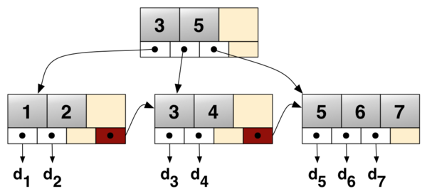

# B 类树 


## 1. B 树

B树（英语：B-tree）是一种自平衡的树，能够保持数据有序。B树和平衡二叉树稍有不同的是B树属于多叉树又名平衡多路查找树（查找路径不只两个）。

鲁道夫·拜尔（Rudolf Bayer）和 艾华·M·麦克雷（Ed M. McCreight）于1972年在波音研究实验室（Boeing Research Labs）工作时发明了B 树，高德纳（Donald Knuth） 在他1980年5月发表的题为“CS144C classroom lecture about disk storage and B-trees”的论文中推测了B树的名字取义，提出“B”可能意味Boeing 或者Bayer 的名字。

### 1.1 定义

根据 Knuth 的定义，一个 m 阶的 B 树是一个有以下属性的树：

1. 每一个节点最多有 *m* 个子节点
2. 每一个非叶子节点（除根节点）最少有 ⌈m/2⌉ 个子节点
3. 如果根节点不是叶子节点，那么它至少有两个子节点
4. 有 k 个子节点的非叶子节点拥有 k − 1 个关键字
5. 所有的叶子节点都在同一层

每一个内部节点的键将节点的子树分开。例如，如果一个内部节点有3个子节点（子树），那么它就必须有两个键： $a1$和 $a2$ 。左边子树的所有值都必须小于 $a1$ ，中间子树的所有值都必须在 $a1$ 和 $a2$ 之间，右边子树的所有值都必须大于 。$a2$


### 插入



所有的插入都从根节点开始。要插入一个新的元素，首先搜索这棵树找到新元素应该被添加到的对应节点。将新元素插入到这一节点中的步骤如下：

1. 如果节点拥有的元素数量小于最大值，那么有空间容纳新的元素。将新元素插入到这一节点，且保持节点中元素有序。
2. 否则的话这一节点已经满了，将它平均地分裂成两个节点：
   1. 从该节点的原有元素和新的元素中选择出中位数
   2. 小于这一中位数的元素放入左边节点，大于这一中位数的元素放入右边节点，中位数作为分隔值。
   3. 分隔值被插入到父节点中，这可能会造成父节点分裂，分裂父节点时可能又会使它的父节点分裂，以此类推。如果没有父节点（这一节点是根节点），就创建一个新的根节点（增加了树的高度）。

如果分裂一直上升到根节点，那么一个新的根节点会被创建，它有一个分隔值和两个子节点。这就是根节点并不像内部节点一样有最少子节点数量限制的原因。每个节点中元素的最大数量是 *U*-1。当一个节点分裂时，一个元素被移动到它的父节点，但是一个新的元素增加了进来。所以最大的元素数量 *U*-1 必须能够被分成两个合法的节点。如果 *U*-1 是奇数，那么 *U*=2*L* ，总共有 2*L*-1 个元素，一个新的节点有 *L*-1 个元素，另外一个有 *L* 个元素，都是合法的节点。如果 *U*-1 是偶数，那么 *U*=2*L*-1,总共有 2*L*-2 个元素。 一半是 *L*-1，正好是节点允许的最小元素数量。


### 删除


```cpp
/*************************************************************
 * https://blog.csdn.net/yejing_utopia/article/details/43126831
 *************************************************************/
 #include <stdio.h>
 #include <stdlib.h>
 #include <string.h>
 #include <assert.h>
 
 /*2,3,4树*/
 #define btree_dg 2
 #define CHILD_NUM  2 * btree_dg
 #define KEY_NUM    2 * btree_dg - 1
 
 
 typedef struct _btree_t{
	int key_count;
	int key[KEY_NUM];
	struct _btree_t* child[CHILD_NUM];
	int is_leaf;
 }btree_t;
 
 static btree_t* allocate_btree_node(void){
	btree_t* node = (btree_t*)malloc(sizeof(btree_t));
	if(!node)
		assert(0);
	memset((char*)node, 0, sizeof(btree_t));
	
	return node;
 }
 
 btree_t* build_a_btree(void){
	btree_t* root = allocate_btree_node();
	if(!root)
		assert(0);
	root->is_leaf = 1;
	
	return root;
 }
 
 btree_t* btree_search(btree_t* root, int key){
	int i = 0;
	while(i < root->key_count && key > root->key[i])
		++i
	if(i < root->key_count && key = root->key[i])
		return root;
		
	if(root->is_leaf)
		return NULL;
	else
		return btree_search(root->child[i], key);
 }
 
 /*
 child是一个满节点，它是其父亲father的第child_index+1个孩子。
 btree_split_child将child按其中间关键字分裂成两个btree_dg-1的子树。
 同时将其中间关键字上浮到father中。
 此函数从根节点由上向下调用，所以father肯定不会是满的。
 */
 void btree_split_child(btree_t* father, btree_t* child, int child_index){
	if(!father || !child || child_index < 0 || child_index + 1 > CHILD_NUM)
		assert(0);
	
	int i = 0;
	//新建一个tmp节点，用于收养child中较大的一半子女
	btree_t* tmp = allocate_btree_node();
	if(!tmp)
		assert(0);
	
	//如果child是叶节点，tmp也应该是叶节点
	tmp->is_leaf = child->is_leaf;
	
	//调整tmp和child的关键字计数
	tmp->key_count = btree_dg - 1;
	child->key_count = btree_dg - 1;
	
	//将child后面一半较大的关键字赋给tmp
	for(i = 0; i < btree_dg - 1; ++i)
		tmp->key[i] = child[btree_dg + i];
	
	//如果child不是叶节点，tmp将收养其后半部分孩子
	if(!child->is_leaf)
		for(i = 0; i < btree_dg; ++i)
			tmp->child[i] = child[btree_dg + i];
			
	//调整father的child指针数组位置，给tmp留出空间，并将tmp托管给father
	for(i = father->key_count; i > index; --i)
		father->child[i + 1] = father->child[i];
	father->child[index + 1] = tmp;
			
	//将child的中间关键值上浮给father
	for(i = father->key_count - 1; i > index - 1; --i)
		father->key[i + 1] = father->key[i];
	father->key[index] = child->[btree_dg - 1];
	
	//最后修改father的keycount
	father->key_count++;
	return;
 }
 
 /*
 将key插入到node中，基于node不是满的。
 在需要时会沿着树向下递归，必要的时候调用btree_split_child分割节点
 */
 void btree_insert_nonfull(btree_t* node, int key){
	if(!node)
		assert(0);
	
 }
 
 btree_t* btree_insert(btree_t* root, int key){
	if(!root)
		assert(0);
		
	btree_t* tmp = root;
	//节点满
	if(tmp->key_count == KEY_NUM){
		btree_t* tmp1 = allocate_btree_node();
		if(!tmp1)
			assert(0);
			
		root = tmp1;
		tmp1->is_leaf = 0;
		tmp1->key_count = 0;
		tmp1->child[0] = tmp;
		btree_split_child(tmp1, 0, root);
		btree_insert_nonfull(tmp1, key);
	}
	else{
		btree_insert_nonfull(tmp, key)
	}
 }
```


### 复杂度

最佳时间复杂度： $O(log n)$
平均空间复杂度： $O(n)$
最坏空间复杂度： $O(n)$


## 2.  B+ 树

### 定义

1. B+树包含2种类型的结点：内部结点（也称索引结点）和叶子结点。根结点本身即可以是内部结点，也可以是叶子结点。根结点的关键字个数最少可以只有1个。

2. B+树与B树最大的不同是内部结点不保存数据，只用于索引，所有数据（或者说记录）都保存在叶子结点中。

3. m阶B+树表示了内部结点最多有m-1个关键字（或者说内部结点最多有m个子树），阶数m同时限制了叶子结点最多存储m-1个记录。

4. 内部结点中的key都按照从小到大的顺序排列，对于内部结点中的一个key，左树中的所有key都**小于**它，右子树中的key都**大于等于**它。叶子结点中的记录也按照key的大小排列。

5. 每个叶子结点都存有相邻叶子结点的指针，叶子结点本身依关键字的大小自小而大顺序链接。




## 3. B* 树


### 定义

B*树是B+树的变种，相对于B+树他们的不同之处如下：

1. 首先是关键字个数限制问题，B+树初始化的关键字初始化个数是cei(m/2)，b*树的初始化个数为（cei(2/3*m)）

2. B+树节点满时就会分裂，而B*树节点满时会检查兄弟节点是否满（因为每个节点都有指向兄弟的指针），如果兄弟节点未满则向兄弟节点转移关键字，如果兄弟节点已满，则从当前节点和兄弟节点各拿出1/3的数据创建一个新的节点出来；


