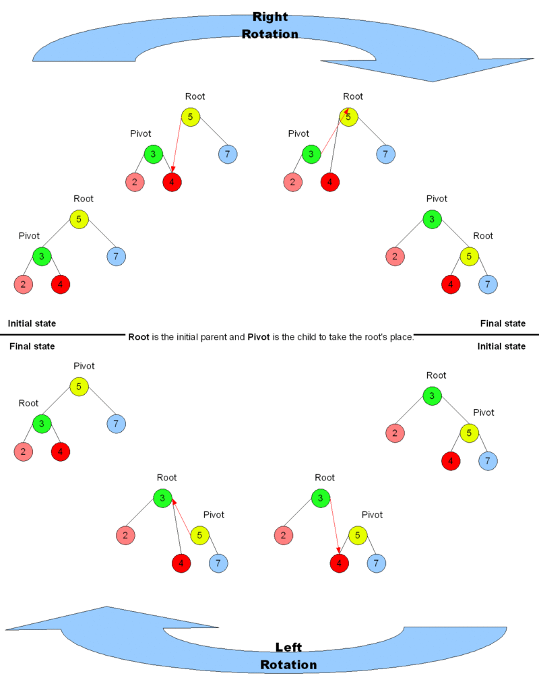

# 红黑树

由于红黑树本质上就是一棵二叉查找树，所以在了解红黑树之前，咱们先来看下二叉查找树。

## 1. 二叉查找树

二叉查找树（Binary Search Tree），是指一棵空树或者具有下列性质的二叉树：

1. 若任意节点的左子树不空，则左子树上所有节点的值均小于它的根节点的值
2. 若任意节点的右子树不空，则右子树上所有节点的值均大于它的根节点的值
3. 任意节点的左、右子树也分别为二叉查找树
4. 没有键值相等的节点（no duplicate nodes）


## 2. 红黑树

R-B Tree，全称是Red-Black Tree，又称为“红黑树”，它一种特殊的二叉查找树。红黑树的每个节点上都有存储位表示节点的颜色，可以是红(Red)或黑(Black)。

<font color=red>**根节点必黑，只能黑连黑，不能红连红； 新增默认是红色，父叔通红就变色，父红叔黑就旋转，哪边黑往哪边转。**</font>

**红黑树的特性**

1. 每个节点要么是红的，要么是黑的
2. 根节点是黑色
3. 每个叶子节点是黑色
4. 如果一个节点是红色的，则它的子节点必须是黑色的
5. 从任一节点到其每个叶子的所有简单路径都包含相同数目的黑色节点

**注意**

+ 特性(3)中的叶子节点，是指为空(NIL或null)的节点。
+ 特性(4)从每个叶子到根的所有路径上不能有两个连续的红色节点


 

## 3.  操作

&emsp;因为每一个红黑树也是一个特化的二叉查找树，因此红黑树上的只读操作与普通二叉查找树上的只读操作相同。

&emsp;在红黑树上进行**插入操作**和**删除操作**会导致不再符合红黑树的性质。恢复红黑树的性质需要少量 ${\displaystyle {\text{O}}(\log n)}$ 的颜色变更（实际是非常快速的）和不超过三次树旋转（对于插入操作是两次）。虽然插入和删除很复杂，但操作时间仍可以保持为 ${\displaystyle {\text{O}}(\log n)}$ 次。


### 3.0 基础操作

#### （1）结构体

```c
enum color_t {
    BLACK,
    RED
};

typedef struct _Red_Black_Tree_Node {
    int                          key;
    enum color_t                 color;
    struct _Red_Black_Tree_Node* parent;
    struct _Red_Black_Tree_Node* left;
    struct _Red_Black_Tree_Node* right;
} RBTNode;
```

#### （2）获取各种节点

```c
RBTNode* GetParent(RBTNode* n) {
    // Note that parent is set to null for the root .
    return n == NULL ? NULL : n->parent;
}

RBTNode* GetGrandParent(RBTNode* n) {
    // Note that it will return NULL if this is root or child of root
    return GetParent(GetParent(n));
}

RBTNode* GetSibling(RBTNode* n) {
    RBTNode* p = GetParent(n);

    // No parent means no sibling.
    if (p == NULL) {
        return NULL;
    }

    if (n == p->left) {
        return p->right;
    } else {
        return p->left;
    }
}

RBTNode* GetUncle(RBTNode* n) {
    RBTNode* p = GetParent(n);

    // No parent means no uncle
    return GetSibling(p);
}
```

#### （3）旋转

&emsp;红黑树是基于二叉查找树，当我们在对红黑树进行插入和删除等操作时，对树做了修改，那么可能会违背红黑树的性质。为了继续保持红黑树的性质，我们可以通过对结点进行重新着色，以及对树进行相关的旋转操作，即修改树中某些结点的颜色及指针结构，来达到对红黑树进行插入或删除结点等操作后，继续保持它的性质。


&emsp;旋转操作不会导致叶节点顺序的改变（可以理解为旋转操作前后，树的**中序遍历**结果是一致的），旋转过程中也始终受**二叉搜索树**的主要性质约束：**右子节点比父节点大、左子节点比父节点小**。

&emsp;尤其需要注意的是，进行右旋转时，旋转前根的左节点的右节点（例如上图中以 *B* 为根的 *${\beta}$* 节点）会变成根的左节点，根本身则在旋转后会变成新的根的右节点，而在这一过程中，整棵树一直遵守着前面提到的几个约束。相反的左旋转操作亦然。



**注意**：这些都有父节点，旋转后新的根节点连接到原来根节点的父节点。


**左旋**

```C
void RotateLeft(RBTNode* n) {
    RBTNode* nnew = n->right;
    RBTNode* p    = GetParent(n);
    // Since the leaves of a red-black tree are empty,
    // they cannot become internal nodes.
    assert(nnew != NULL);

    n->right   = nnew->left;
    nnew->left = n;
    n->parent  = nnew;
    // Handle other child/parent pointers.
    if (n->right != NULL) {
        n->right->parent = n;
    }

    // Initially n could be the root.
    if (p != NULL) {
        if (n == p->left) {
            p->left = nnew;
        } else if (n == p->right) {
            p->right = nnew;
        }
    }
    nnew->parent = p;
}
```

**右旋**

```c
void RotateRight(RBTNode* n) {
    RBTNode* nnew = n->left;
    RBTNode* p    = GetParent(n);
    // Since the leaves of a red-black tree are empty,
    // they cannot become internal nodes.
    assert(nnew != NULL);

    n->left     = nnew->right;
    nnew->right = n;
    n->parent   = nnew;

    // Handle other child/parent pointers.
    if (n->left != NULL) {
        n->left->parent = n;
    }

    // Initially n could be the root.
    if (p != NULL) {
        if (n == p->left) {
            p->left = nnew;
        } else if (n == p->right) {
            p->right = nnew;
        }
    }
    nnew->parent = p;
}
```


### 3.1 插入

<font color=red>在下面的示意图中，将要插入的节点标为**N**(node)，N的父节点标为**P**(parent)，N的祖父节点标为**G**(grandfather)，N的叔父节点标为**U**(uncle)</font>

#### （1）插入步骤

先构想一下插入步骤

1. 通过二叉查找树的递归方法找到插入位置并将新节点插入
2. 插入后可能不符合性质，需要调整插入结点周围的位置或颜色
3. 最后返回根节点

插入首先以与标准二叉搜索树插入非常相似的方式添加节点，并将其着色为红色。最大的区别在于，在二叉搜索树中，一个新节点被添加为一个叶，而叶在红黑树中不包含任何信息，因此新节点替换了一个现有的叶子，然后添加了两个自己的黑叶子。

```c
RBTNode* Insert(RBTNode* root, RBTNode* n) {
    // Insert new RBTNode into the current tree.
    InsertRecurse(root, n);

    // Repair the tree in case any of the red-black properties have been violated.
    InsertRepairTree(n);

    // Find the new root to return.
    root = n;
    while (GetParent(root) != NULL) {
        root = GetParent(root);
    }
    return root;
}

void InsertRecurse(RBTNode* root, RBTNode* n) {
    // Recursively descend the tree until a leaf is found.
    if (root != NULL) {
        if (n->key < root->key) {
            if (root->left != NULL) {
                InsertRecurse(root->left, n);
                return;
            } else {
                root->left = n;
            }
        } else { // n->key >= root->key
            if (root->right != NULL) {
                InsertRecurse(root->right, n);
                return;
            } else {
                root->right = n;
            }
        }
    }

    // Insert new RBTNode n.
    n->parent = root;
    n->left   = NULL;
    n->right  = NULL;
    n->color  = RED;
}
```


#### （2）插入修复

&emsp;我们首先以二叉查找树的方法增加节点并标记它为红色。（如果设为黑色，就会导致根到叶子的路径上有一条路上，多一个额外的黑节点，这个是很难调整的。但是设为红色节点后，可能会导致出现两个连续红色节点的冲突，那么可以通过颜色调换（color flips）和树旋转来调整。）下面要进行什么操作取决于其他临近节点的颜色。

**有几种红黑树插入需要处理**:

1. N为根节点，即红黑树的第一个节点
2. N的父母（P）是黑色
3. P是红色的（所以它不可能是树根），N的叔叔（U）是红色的
4. P是红色的，U是黑色的

```c
void InsertRepairTree(RBTNode* n) {
    if (GetParent(n) == NULL) {
        InsertCase1(n);
    } else if (GetParent(n)->color == BLACK) {
        InsertCase2(n);
    } else if (GetUncle(n) != NULL && GetUncle(n)->color == RED) {
        InsertCase3(n);
    } else {
        InsertCase4(n);
    }
}
```

**注意**：

- 属性1（每个节点都是红色或黑色）和属性3（所有叶子都是黑色）始终有效。
- 属性2（根为黑色）但插入为红色需检查并更正为情形1。
- 属性4（红色节点只有黑色子节点）仅通过添加红色节点、将节点从黑色重新绘制为红色或旋转来受到威胁。
- 属性5（从任何给定节点到其叶的所有路径都具有相同数量的黑色节点）仅通过添加黑色节点、重新绘制节点或旋转来受到威胁。


**情形1**: 新节点N位于树的根上，没有父节点。在这种情形下，我们把它重绘为黑色以满足性质2。因为它在每个路径上对黑节点数目增加一，性质5符合。

```c
void InsertCase1(RBTNode* n) {
    n->color = BLACK;
}
```


**情形2**: 新节点的父节点P是黑色，所以性质4没有失效（新节点是红色的）。在这种情形下，树仍是有效的。性质5也未受到威胁，尽管新节点N有两个黑色叶子子节点；但由于新节点N是红色，通过它的每个子节点的路径就都有同通过它所取代的黑色的叶子的路径同样数目的黑色节点，所以依然满足这个性质。

```c
void InsertCase2(RBTNode* n) {
    // Do nothing since tree is still valid.
    return;
}
```

 

**注意**：在下面的情况下，可以假设N有一个祖父母节点G，因为它的父节点P是红色的，如果它是根节点，它将是黑色的。因此，N也具有叔叔节点U，尽管在情况4中它可以是叶。 
**注意**：在其余的情况下，图中显示了父节点P是其父节点的左子节点，即使P可能位于任意一侧。代码示例已经涵盖了这两种可能性。 


**情况3**：如果父节点P和父节点U都是红色的，那么它们都可以重新绘制为黑色，而祖父母G则变为红色以保持属性5（从节点到叶子的所有路径都包含相同数量的黑色节点）。由于通过父节点或父节点的任何路径都必须经过祖父母节点，所以这些路径上的黑色节点数没有改变。但是，如果祖父母G是根，那么它现在可能会违反属性2（根是黑色的），如果它有一个红色的父节点，则它可能违反属性4（每个红色节点的两个子节点都是黑色的）。为了解决这个问题，树的红黑修复过程在G上重新运行。


```c
void InsertCase3(RBTNode* n) {
    GetParent(n)->color      = BLACK;
    GetUncle(n)->color       = BLACK;
    GetGrandParent(n)->color = RED;
    InsertRepairTree(GetGrandParent(n));
}
```


**注意**：在余下的情形下，我们假定父节点P是其祖父G的左子节点。如果它是右子节点，情形4和情形4_2中的*左*和*右*应当对调。

**情况4**: 步骤1：父元素P是红色的，但是U叔叔是黑色的（这意味着P的左或右子元素必须是黑色的）。最终目标是将新节点N旋转到祖父位置，但如果N位于G下子树的“内部”（即，如果N是G的右子节点的左子节点或G的左子节点的右子节点），则这将不起作用。在这个例子中，我们通过一个标记为“P”的子树的旋转（在这个例子中，我们通过一个标记为“P”的子树的旋转来增加它的子路径）。但是P和N都是红色的，所以属性5（从一个节点到它的叶子的所有路径包含相同数量的黑色节点）被保留。属性4（每个红色节点的两个子节点都是黑色的）在步骤2中被恢复。 


```c
void InsertCase4(RBTNode* n) {
    RBTNode* p = GetParent(n);
    RBTNode* g = GetGrandParent(n);

    if (n == p->right && p == g->left) {
        RotateLeft(p);
        n = n->left;
    } else if (n == p->left && p == g->right) {
        RotateRight(p);
        n = n->right;
    }

    InsertCase4Step2(n);
}
```


**情况4**: 步骤2：新节点N现在确定位于祖父母G下子树的“外部”（左边的子节点或右边的子节点的右边）。在G上做一个右旋转，用P代替G，使P成为N和G的父对象。G是黑色的，它的前一个子P是红色的，因为违反了属性4。切换P和G的颜色。生成的树满足属性4（红色节点有黑色子节点）。从G到N的所有路径都满足了，因为P穿过了所有的路径。 


```c
void InsertCase4Step2(RBTNode* n) {
    RBTNode* p = GetParent(n);
    RBTNode* g = GetGrandParent(n);

    if (n == p->left) {
        RotateRight(g);
    } else {
        RotateLeft(g);
    }
    p->color = BLACK;
    g->color = RED;
}
```


&emsp;在上面的算法中，所有的情况只被调用一次，除了在情况3中，它可以递归回使用祖父母节点的情况1，这是唯一一个迭代实现将有效循环的情况。因为在这种情况下，修复问题每次都会升级两个级别（修复祖父节点），所以修复树（其中h是树的高度）最多需要h⁄2次迭代。因为升级的概率随着每次迭代而呈指数级降低，所以平均插入成本实际上是恒定的。


### 3.2 删除


## 红黑树的应用

红黑树的时间复杂度为: O(lgn)

1. Java 集合中的 TreeSet、TreeMap
2. C++ STL 中的 set、map
3. Linux 虚拟内存的管理


## 参考资料

(1) [浅析红黑树（RBTree）原理及实现](https://blog.csdn.net/tanrui519521/article/details/80980135)

(2) [红黑树(一)之 原理和算法详细介绍](https://www.cnblogs.com/skywang12345/p/3245399.html)

(3) [教你透彻了解红黑树](https://github.com/julycoding/The-Art-Of-Programming-By-July/blob/master/ebook/zh/03.01.md)

(4) 维基百科：中文版C++ [红黑树](https://zh.wikipedia.org/wiki/%E7%BA%A2%E9%BB%91%E6%A0%91#%E6%8F%92%E5%85%A5)、英文版C [Red–black tree](https://en.wikipedia.org/wiki/Red%E2%80%93black_tree)
